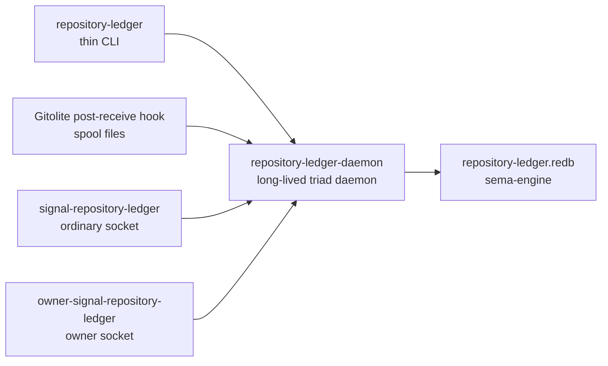

# repository-ledger Architecture

`repository-ledger` records repository changes after they are pushed to the
local Gitolite server.

The current CriomOS `repository-receive` hook writes
`RepositoryReceiveHookNotification` NOTA files into
`/var/lib/repository-ledger/spool`. The daemon will consume those files and
assert typed repository events into its sema-engine database. Once the daemon
socket exists, the hook can also detect that socket and future work can replace
spool-only delivery with a direct Signal submit path.

## Component Shape

## Owns

- One `sema-engine` database.
- Repository event records from post-push hook notifications.
- Repository registration policy.
- Future mirror policy state.

## Does Not Own

- Gitolite installation. CriomOS owns the service.
- GitHub mirroring execution in the first slice.
- Report authoring or commit-message policy.

## Constraints

- The CLI talks only to `repository-ledger-daemon`.
- The daemon has separate listener actors for ordinary and owner contracts.
- Owner-only configuration arrives only through `owner-signal-repository-ledger`.
- Every stored record is a typed Rust record; no line-oriented log is source of
  truth.
- NOTA appears at CLI/spool/debug edges. Inter-component traffic is Signal.

## First Slice

This initial repository proves the storage boundary:

- Contract crates compile with `signal_channel!`.
- The runtime crate can open a sema-engine database.
- Hook notifications can be stored as typed repository events.
- The server-side Gitolite repositories exist and can receive pushes.

The daemon socket actors are the next slice.
