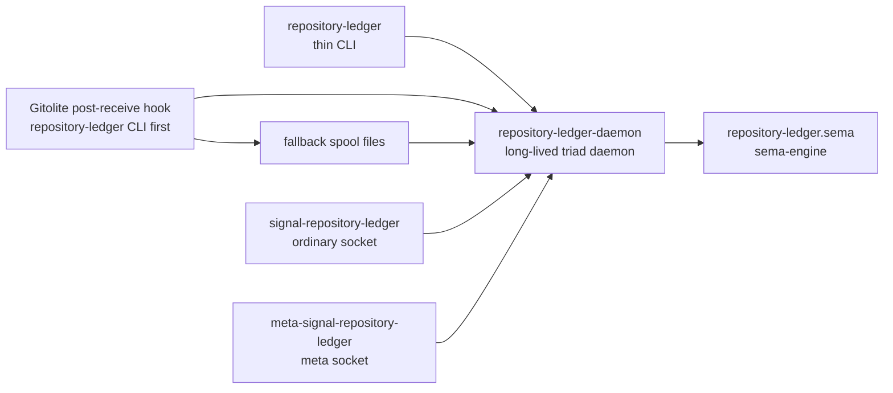

# repository-ledger Architecture

`repository-ledger` records repository changes after they are pushed to the
local Gitolite server.

The current CriomOS `repository-receive` hook invokes the `repository-ledger`
CLI with a `PushObservation` NOTA request. The CLI is the ordinary
Signal client: it connects to `repository-ledger-daemon`, sends the typed
request, and prints the typed reply. The hook still writes a
`ReceiveHookNotification` spool file as a fallback if the CLI
submission fails.

## Component Shape



## Owns

- One `sema-engine` database.
- Repository event records from post-push hook notifications.
- Repository commit observations derived from pushed commits.
- Repository file-change observations derived from pushed commits.
- Repository registration policy.
- Spool directory policy.
- Mirror policy state.

## Does Not Own

- Gitolite installation. CriomOS owns the service.
- GitHub mirroring execution in the first slice.
- Report authoring or commit-message policy.

## Constraints

- The CLI talks only to `repository-ledger-daemon`.
- The daemon has separate listener actors for ordinary and meta contracts.
- Meta-signal configuration arrives only through `meta-signal-repository-ledger`.
- The daemon startup configuration is one typed
  signal-encoded rkyv `DaemonConfiguration` file from
  `signal-repository-ledger`; the daemon rejects inline NOTA and
  `.nota` files.
- Every stored record is a typed Rust record; no line-oriented log is source of
  truth.
- NOTA appears at CLI/spool/debug edges. Inter-component traffic is Signal.
- Agent discovery queries are first-class ordinary-contract `Query` operations:
  recent repositories, changed files, and commit-message search.
- Commit-message and file-path searches are case-insensitive substring matches
  in the first implementation.
- Time-window queries compare received-at timestamps in their canonical
  UTC-sortable string form. This is acceptable while the contract still uses
  `Timestamp(String)` and should collapse into native timestamp
  comparison when the workspace timestamp type lands.

## Current Slice

This repository now proves the first live triad boundary:

- Contract crates compile with `signal_channel!`.
- The runtime crate can open a sema-engine database.
- Hook notifications can be stored as typed repository events.
- Direct push observations can store commit messages and changed files.
- The server-side Gitolite repositories exist and can receive pushes.
- The daemon can answer ordinary `Query` operations and meta policy
  operations over Signal frames.
- The daemon can answer agent-facing discovery queries for recent repositories,
  changed files, and commit messages.
- The spool reader parses the fallback CriomOS hook projection and moves files
  to `processed/` after commit.

## Pseudo-NOTA Entry And Query Shape

The direct hook entry is:

```nota
(Observe
  ((ReceiveHookNotification
    [repository-ledger]
    [gitolite-admin]
    [20260519T140736Z]
    True
    [(RefUpdate [old-commit] [new-commit] [refs/heads/main])])
   [(CommitObservation
      [new-commit]
      [refs/heads/main]
      [2026-05-19T14:07:36+00:00]
      [|add repository query surface

Longer commit body.|]
      [(FileChange [M] [src/lib.rs] None)
       (FileChange [A] [tests/store.rs] None)])]))
```

The basic agent queries are:

```nota
# Which repositories were edited recently?
(Query (RecentRepositories ((Some [20260519T000000Z]) 20)))

# Which files changed in a repository during a time period?
(Query (ChangedFiles
  (Some [repository-ledger])
  (Some [20260519T000000Z])
  (Some [20260519T235959Z])
  None
  100))

# Which changed files contain a path substring?
(Query (ChangedFiles (None None None (Some [ARCHITECTURE]) 50)))

# Which commits have messages containing a string?
(Query (CommitMessages (None None None (Some [query surface]) 50)))
```

The query examples above show the contract-local operation head (`Query`) and
the query sum variant inside it. Present optional values use `(Some value)`;
absent values use `None`.
